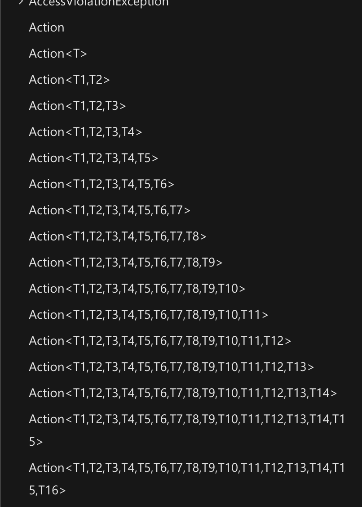
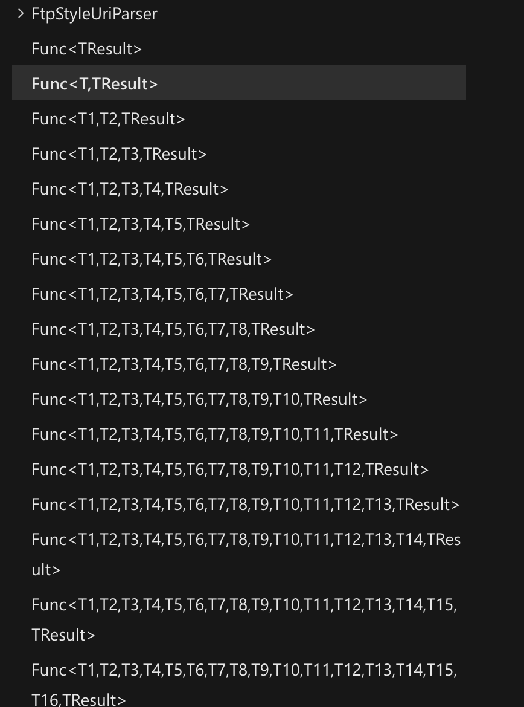

# NET 6 速览

## [c#/.NET](https://docs.microsoft.com/zh-cn/dotnet)

### 概述

原Borland公司的首席研发设计师安德斯·海尔斯伯格（Anders Hejlsberg）在微软开发了Visual J++ 1.0，很快的Visual J++由1.1版本升级到6.0版。SUN公司认为Visual J++ 违反了Java开发平台的中立性，对微软提出了诉讼。2000年6月26日微软在奥兰多举行的“职业开发人员技术大会”（PDC 2000）上，发表新的语言C#。C#语言取代了Visual J++，语言本身深受Visual Basic、Java、C和C++ 的影响。

### 面向对象

C#是微软推出的一种基于.NET框架的、面向对象的高级编程语言。C#是一种由C和C++派生出来的面向对象的编程语言。它在继承C和C++强大功能的同时去掉了一些它们的复杂特性，使其成为C语言家族中的一种高效强大的编程语言。C#以.NET框架类库作为基础，拥有类似Visual Basic的快速开发能力。

- System.Object
  支持 .NET 类层次结构中的所有类，并为派生类提供低级别服务。 这是所有 .NET 类的最终基类；它是类型层次结构的根。提供了四个公共实例方法：
  ToString,Equals,GetHashCode和GetType

  ```mermaid
    classDiagram
  
          class Object{
          +ToString() string
          +Equals(Object) boolean
          +GetHashCode()* int
          +GetType() Type
      }
  ```

  c# 不支持多重继承，仅能从一个基类派生,所有的类型基础均为System.Object
- 接口

    接口定义协定。 实现该协定的任何 class 或 struct 必须提供接口中定义的成员的实现。 从 C# 8.0 开始，接口可为成员定义默认实现。 它还可以定义 static 成员，以便提供常见功能的单个实现。
  - 方法
  - 事件
  - 无参属性(常见的get/set封装属性)
  - 有参属性(索引器)
  
```c#
public interface IEat
{
    //方法
    void Eat();
    //属性
    string Eater{get;set;}
    //事件
    EventHandler<Food> Eated;
    //索引器-在这里定义有点生硬仅为展示能力
    string this[int Index];
}
```


#### Delegate-委托

委托是安全封装方法的类型，类似于 C 和 C++ 中的函数指针。 与 C 函数指针不同的是，委托是面向对象的、类型安全的和可靠的。

- 实现回调,且类型安全(函数指针能做的它都能做)

- 多播
  
  ```c#
  delegate void Do();
  ```

  ```c
  .class private sealed auto ansi
  Pulse.Tests.Do
    extends [System.Runtime]System.MulticastDelegate
    {
  
    .method public hidebysig specialname rtspecialname instance void
        .ctor(
        object 'object',
        native int 'method'
        ) runtime managed
    {
        // Can't find a body
    } // end of method Do::.ctor
  
    .method public hidebysig virtual newslot instance void
        Invoke() runtime managed
    {
        // Can't find a body
    } // end of method Do::Invoke
  
    .method public hidebysig virtual newslot instance class [System.Runtime]System.IAsyncResult
        BeginInvoke(
        class [System.Runtime]System.AsyncCallback callback,
        object 'object'
        ) runtime managed
    {
        // Can't find a body
    } // end of method Do::BeginInvoke
  
    .method public hidebysig virtual newslot instance void
        EndInvoke(
        class [System.Runtime]System.IAsyncResult result
        ) runtime managed
    {
        // Can't find a body
    } // end of method Do::EndInvoke
    } // end of class Pulse.Tests.Do
  
  ```

- 内置委托Action/Func
 
  
  

####  Lambda 表达式

- 属性
  
  ```csharp
   public string Name 
   {
       get => CalcluateName();
       set => SetNameWithSomeValidation(value);
   }
  ```

- 方法
  
    ```csharp
    public string GetSomeString(string input)=>OrderAsc((input)=>{input.ToLower();}));

    public string OrderAsc(Action<string> action)
    {
        var string =action?.Invoke();
        //DoOrder;
        // ...
    }
    ```

#### 异步编程

- 线程
  - System.Threading/System.Threading.Thread
    - [Managed vs. Native Threads(托管和非托管线程)](https://github.com/dotnet/runtime/blob/main/docs/design/coreclr/botr/threading.md)
    
    Managed code executes on "managed threads," which are distinct from the native threads provided by the operating system. A native thread is a thread of execution of native code on a physical machine; a managed thread is a virtual thread of execution on the CLR's virtual machin　.
    
  - Thread.Abort 已过时
从 .NET 5 开始，Thread.Abort 以警告的形式标记为已过时。 调用此方法将生成编译器警告 SYSLIB0006。 该方法的实现保持不变，并且继续引发 PlatformNotSupportedException。

- 异步编程
  - 基于任务的异步编程模型 (TAP) 提供了异步代码的抽象化。 你只需像往常一样将代码编写为一连串语句即可。 就如每条语句在下一句开始之前完成一样，你可以流畅地阅读代码。 编译器将执行许多转换，因为其中一些语句可能会开始运行并返回表示正在进行的工作的 Task。
  - 使用 Async 和 Await 的异步编程
  典型实现:
  
  ```csharp
      public static async Task DispatchDomainEventsAsync(this IMediator mediator, OrderingContext ctx)
    {
        var domainEntities = ctx.ChangeTracker
            .Entries<Entity>()
            .Where(x => x.Entity.DomainEvents != null && x.Entity.DomainEvents.Any());

        var domainEvents = domainEntities
            .SelectMany(x => x.Entity.DomainEvents)
            .ToList();

        domainEntities.ToList()
            .ForEach(entity => entity.Entity.ClearDomainEvents());

        foreach (var domainEvent in domainEvents)
            await mediator.Publish(domainEvent);
    }

  ```
- 并行编程


```csharp
static void SequentialDemo()
{
    var orders = GetOrders();
    var query = (from order in orders.AsParallel()
                 orderby order.OrderID
                 select new
                 {
                     order.OrderID,
                     OrderedOn = order.OrderDate,
                     ShippedOn = order.ShippedDate
                 })
                 .AsSequential().Take(5);
}
````

### 类型安全
作为c#的运行时，它总是知道对象的类型是什么，GetType是非虚方法，总是能够返回对象的真实类型。clr允许对象转换为它的实际类型或者他的任何基类型。

### P/Invoke-互操作

### 体系结构

- .NET5/6(.NET Core 1-3.1)
- .NET Framework
- Mono
- UWP 
- .NET Standard

### 工具

#### .NET SDK

#### .NET CLI

### 执行模型

### 运行时-.NET runtime


## 应用程序模型

### 桌面

### WEB

### 移动端

## Demo

## 延伸主题

