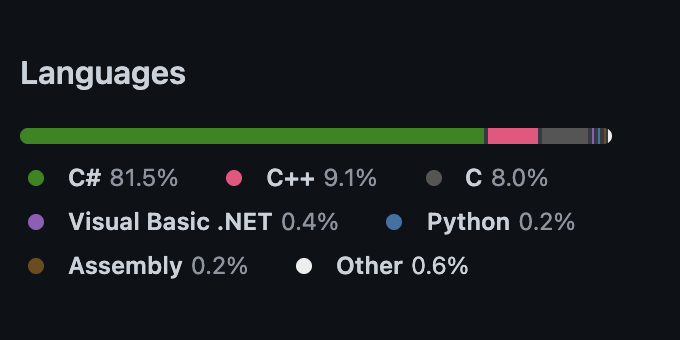
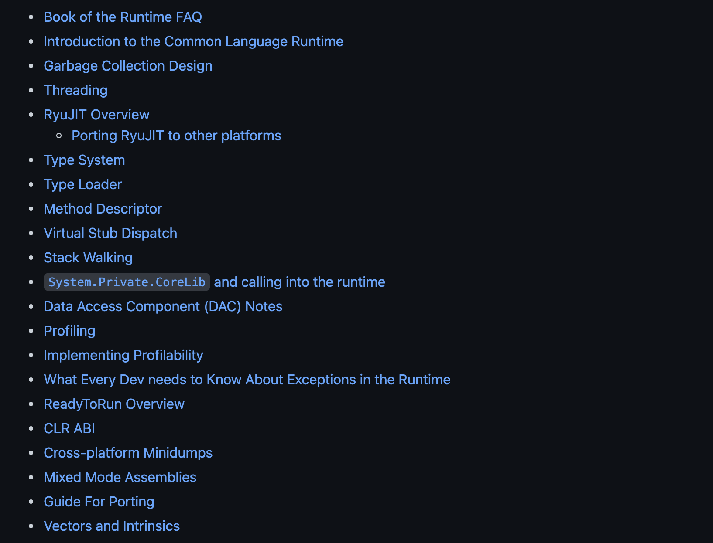
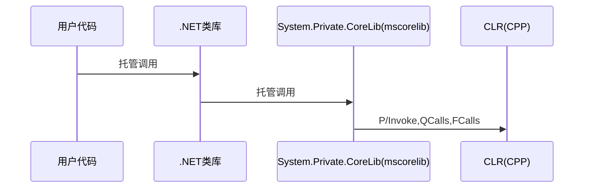
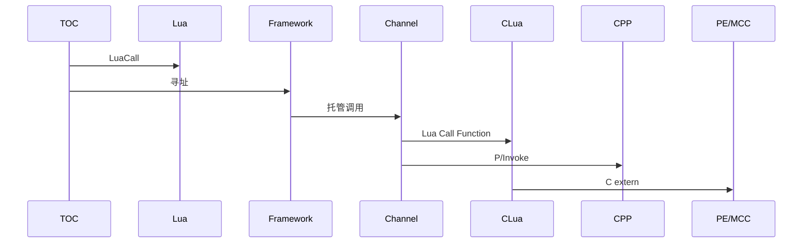

# NET 6 速览

## [C#/.NET](https://docs.microsoft.com/zh-cn/dotnet)

### 概述

原Borland公司的首席研发设计师安德斯·海尔斯伯格（Anders Hejlsberg）在微软开发了Visual J++ 1.0，很快的Visual J++由1.1版本升级到6.0版。SUN公司认为Visual J++ 违反了Java开发平台的中立性，对微软提出了诉讼。2000年6月26日微软在奥兰多举行的“职业开发人员技术大会”（PDC 2000）上，发表新的语言C#。C#语言取代了Visual J++，语言本身深受Visual Basic、Java、C和C++ 的影响。

### 面向对象

C#是微软推出的一种基于.NET框架的、面向对象的高级编程语言。C#是一种由C和C++派生出来的面向对象的编程语言。它在继承C和C++强大功能的同时去掉了一些它们的复杂特性，使其成为C语言家族中的一种高效强大的编程语言。C#以.NET框架类库作为基础，拥有类似Visual Basic的快速开发能力。

- System.Object
  支持 .NET 类层次结构中的所有类，并为派生类提供低级别服务。 这是所有 .NET 类的最终基类；它是类型层次结构的根。提供了四个公共实例方法：
  ToString,Equals,GetHashCode和GetType

  ```mermaid
    classDiagram
  
          class Object{
          +ToString() string
          +Equals(Object) boolean
          +GetHashCode()* int
          +GetType() Type
      }
  ```

  c# 不支持多重继承，仅能从一个基类派生,所有的类型基础均为System.Object
- 接口

    接口定义协定。 实现该协定的任何 class 或 struct 必须提供接口中定义的成员的实现。 从 C# 8.0 开始，接口可为成员定义默认实现。 它还可以定义 static 成员，以便提供常见功能的单个实现。
  - 方法
  - 事件
  - 无参属性(常见的get/set封装属性)
  - 有参属性(索引器)
  
```c#
public interface IEat
{
    //方法
    void Eat();
    //属性
    string Eater{get;set;}
    //事件
    EventHandler<Food> Eated;
    //索引器-在这里定义有点生硬仅为展示能力
    string this[int Index];
}
```


#### Delegate-委托

委托是安全封装方法的类型，类似于 C 和 C++ 中的函数指针。 与 C 函数指针不同的是，委托是面向对象的、类型安全的和可靠的。

- 实现回调,且类型安全(函数指针能做的它都能做)

- 多播
  
  ```c#
  delegate void Do();
  ```

  ```c
  .class private sealed auto ansi
  Pulse.Tests.Do
    extends [System.Runtime]System.MulticastDelegate
    {
  
    .method public hidebysig specialname rtspecialname instance void
        .ctor(
        object 'object',
        native int 'method'
        ) runtime managed
    {
        // Can't find a body
    } // end of method Do::.ctor
  
    .method public hidebysig virtual newslot instance void
        Invoke() runtime managed
    {
        // Can't find a body
    } // end of method Do::Invoke
  
    .method public hidebysig virtual newslot instance class [System.Runtime]System.IAsyncResult
        BeginInvoke(
        class [System.Runtime]System.AsyncCallback callback,
        object 'object'
        ) runtime managed
    {
        // Can't find a body
    } // end of method Do::BeginInvoke
  
    .method public hidebysig virtual newslot instance void
        EndInvoke(
        class [System.Runtime]System.IAsyncResult result
        ) runtime managed
    {
        // Can't find a body
    } // end of method Do::EndInvoke
    } // end of class Pulse.Tests.Do
  
  ```

- 内置委托Action/Func

  
  

####  Lambda 表达式

- 属性
  
  ```csharp
   public string Name 
   {
       get => CalcluateName();
       set => SetNameWithSomeValidation(value);
   }
  ```

- 方法
  
    ```csharp
    public string GetSomeString(string input)=>OrderAsc((input)=>{input.ToLower();}));
    
    public string OrderAsc(Action<string> action)
    {
        var string =action?.Invoke();
        //DoOrder;
        // ...
    }
    ```

#### 异步编程

- 线程
  - System.Threading/System.Threading.Thread
    - [Managed vs. Native Threads(托管和非托管线程)](https://github.com/dotnet/runtime/blob/main/docs/design/coreclr/botr/threading.md)
    
    Managed code executes on "managed threads," which are distinct from the native threads provided by the operating system. A native thread is a thread of execution of native code on a physical machine; a managed thread is a virtual thread of execution on the CLR's virtual machin　.
    
  - Thread.Abort 已过时
  从 .NET 5 开始，Thread.Abort 以警告的形式标记为已过时。 调用此方法将生成编译器警告 SYSLIB0006。 该方法的实现保持不变，并且继续引发 PlatformNotSupportedException。

- 异步编程
  - 基于任务的异步编程模型 (TAP) 提供了异步代码的抽象化。 你只需像往常一样将代码编写为一连串语句即可。 就如每条语句在下一句开始之前完成一样，你可以流畅地阅读代码。 编译器将执行许多转换，因为其中一些语句可能会开始运行并返回表示正在进行的工作的 Task。
  - 使用 Async 和 Await 的异步编程
  典型实现:
  
  ```csharp
      public static async Task DispatchDomainEventsAsync(this IMediator mediator, OrderingContext ctx)
    {
        var domainEntities = ctx.ChangeTracker
            .Entries<Entity>()
            .Where(x => x.Entity.DomainEvents != null && x.Entity.DomainEvents.Any());
  
        var domainEvents = domainEntities
            .SelectMany(x => x.Entity.DomainEvents)
            .ToList();
  
        domainEntities.ToList()
            .ForEach(entity => entity.Entity.ClearDomainEvents());
  
        foreach (var domainEvent in domainEvents)
            await mediator.Publish(domainEvent);
    }
  
  ```
- 并行编程


```csharp
static void SequentialDemo()
{
    var orders = GetOrders();
    var query = (from order in orders.AsParallel()
                 orderby order.OrderID
                 select new
                 {
                     order.OrderID,
                     OrderedOn = order.OrderDate,
                     ShippedOn = order.ShippedDate
                 })
                 .AsSequential().Take(5);
}
````

### 类型安全
作为c#的运行时，它总是知道对象的类型是什么，GetType是非虚方法，总是能够返回对象的真实类型。clr允许对象转换为它的实际类型或者他的任何基类型。

### P/Invoke-互操作

#### 从托管代码调用非托管代码

P/Invoke 是可用于从托管代码访问非托管库中的结构、回调和函数的一种技术。 大多数 P/Invoke API 包含在以下两个命名空间中：System 和 System.Runtime.InteropServices。 使用这两个命名空间可提供用于描述如何与本机组件通信的工具。

运行时允许通信流量双向流通，这样，便可以使用函数指针从本机函数回调托管代码。 在托管代码中，与函数指针最接近的功能就是委托，正是凭借这个功能，才能从本机代码回调托管代码。

#### 从非托管代码调用托管代码

此功能的使用方式类似于上面所述的从托管代码调用本机进程。 对于给定的回调，需要定义一个与签名匹配的委托，并将其传入外部方法。 运行时将负责处理所有剩余工作。

#### 跨平台P/Invoke

##### .NET运行时在不同操作系统下提供自动动态连结库搜索

```csharp
[DllImport("nativedep")]
static extern int ExportedFunction();

```
  - Windows会自动检索
    nativedep
    nativedep.dll (if the library name does not already end with .dll or .exe)

  - 在Linux和macOS下
    会自动进行一下检索
    nativedep.so / nativedep.dylib
    libnativedep.so / libnativedep.dylib 1
    nativedep
    libnativedep

##### 从非托管接口自动生成c#代码

- [CsWin32](https://github.com/microsoft/CsWin32)
  
  C#/Win32 P/Invoke Source Generator
  A source generator to add a user-defined set of Win32 P/Invoke methods and supporting types to a C# project.

- [CppSharp](https://github.com/mono/CppSharp)
  
  CppSharp is a tool and set of libraries which facilitates the usage of native C/C++ code with the .NET ecosystem.
  It consumes C/C++ header and library files and generates the necessary glue code to surface the native API as a managed API. Such an API can be used to consume an existing native library in your managed code or add managed scripting support to a native codebase.

### 体系结构

- 跨平台实现
  - .NET5/6(.NET Core 1-3.1)
  现代 .NET，专门设计用于处理大规模的服务器和云工作负载。 它还支持其他工作负载，包括桌面应用（NETCORE3.1以后)。 可在 Windows、macOS 和 Linux 上运行。 它可实现 .NET Standard，因此面向 .NET Standard 的代码都可在 .NET 5 上运行。
  - .NET Standard
    .NET Standard 是针对多个 .NET 实现推出的一套正式的 .NET API 规范。 推出 .NET Standard 的背后动机是要提高 .NET 生态系统中的一致性。 但是，.NET 5 采用不同的方法来建立一致性，这种新方法在很多情况下都不需要 .NET Standard。换句话说，如果所有代码均基于最新的NET5以后的版本构建，则不需要在使用.NET Standard.
- Mono
  Mono 是主要在需要小型运行时使用的 .NET 实现。 它是在 Android、macOS、iOS、tvOS 和 watchOS 上驱动 Xamarin 应用程序的运行时，且主要针对小内存占用。 Mono 还支持使用 Unity 引擎生成的游戏。
  它支持所有当前已发布的 .NET Standard 版本。
  以前，Mono 实现更大的 .NET Framework API 并模拟一些 Unix 上最常用的功能。 有时使用它运行依赖 Unix 上的这些功能的 .NET 应用程序。
- Windows平台
  - .NET Framework
    WPF/WinForm,目前Phoenix所使用的实现基于.NET Framework 4.5.1,最新的是4.8
  - UWP 
    UWP 是创建适用于 Windows 的客户端应用程序的众多方法之一。 UWP 应用使用 WinRT API 来提供强大的 UI 和高级异步功能，这些功能非常适用于 Internet 连接的设备。

### 工具

#### .NET SDK
.NET SDK 是一组库和工具，开发人员可用其创建 .NET 应用程序和库。 它包含以下用于构建和运行应用程序的组件：
- .NET CLI。
- .NET 库和运行时。
- dotnet 驱动程序。

##### .NET CLI
.NET 命令行接口 (CLI) 工具是用于开发、生成、运行和发布 .NET 应用程序的跨平台工具链。

```csharp
dotnet new console
dotnet build --output ./build_output
dotnet ./build_output/my_app.dll

dotnet run XXXX
dotnet test XXXX

```

##### 驱动程序

驱动程序名为 dotnet，并具有两项职责，即运行依赖于框架的应用或执行命令。

## [.NET库和运行时](https://github.com/dotnet/runtime)

NET 提供了一个称为公共语言运行时的运行时环境，它运行代码并提供使开发过程更轻松的服务。
公共语言运行时的功能通过编译器和工具公开，你可以编写利用此托管执行环境的代码。 使用面向运行时的语言编译器开发的代码称为托管代码。 托管代码具有许多优点，例如：跨语言集成、跨语言异常处理、增强的安全性、版本控制和部署支持、简化的组件交互模型、调试和分析服务等。


[Document Index](https://github.com/dotnet/runtime/blob/main/docs/README.md)



### [Book of the Runtime-BOTR](https://github.com/dotnet/runtime/tree/main/docs/design/coreclr/botr)




### 执行模型

作为托管代码和非托管实现的入口
体现:.NET Framework中的mscorelib
.NET Core/.NET5/6中的System.Private.CoreLib







## 应用程序模型
### 依赖倒置

直接依赖


依赖倒置-控制反转


### 通用主机
主机是封装应用资源的对象，例如：

- 依赖关系注入 (DI)
- Logging
- Configuration
- IHostedService
  - Console Application
  - Web
  - Desktop
  - Mobile?

### 桌面

- 通用 Windows 平台 
- WPF
- WinForm
- Xamarin.Mac
- MAUI-Preview

### WEB

- AspNetCore
  - Razor
  - MVC
    - Web Page
    - Web API
  - Blazor
    -  C# 代替 JavaScript
    -  Blazor WebAssembly
    -  Blazor Server
- Asp.Net
- 管道和中间件
  

  ```csharp
  app.UseHttpsRedirection();
  app.UseStaticFiles();
  // app.UseCookiePolicy();
  
  app.UseRouting();
  // app.UseRequestLocalization();
  // app.UseCors();
  
  app.UseAuthentication();
  app.UseAuthorization();
  // app.UseSession();
  // app.UseResponseCompression();
  // app.UseResponseCaching();
  ```
### 移动端

- Xamarin.Forms
- Xamarin.iOS
- Xamarin.Android

## Demo

参考src目录
## 延伸主题

docker

